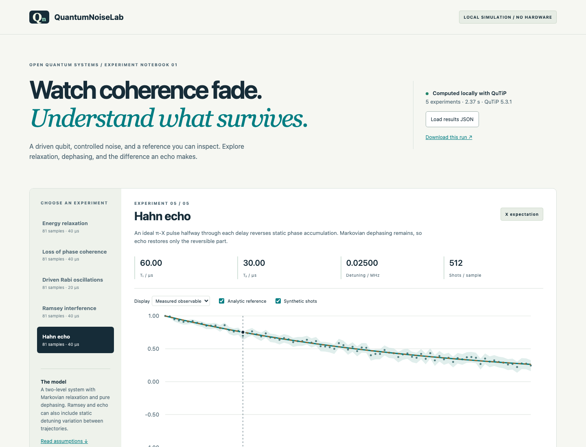

# QuantumNoiseLab

**Simulate qubit relaxation, dephasing and driven dynamics.**

QuantumNoiseLab uses [QuTiP](https://qutip.org/) to solve two-level quantum models and generate reports. Run five driven-qubit and decoherence experiments, compare analytical limits, inspect finite-shot uncertainty, and explore the computed results in an offline browser dashboard.

The calculations run on a classical CPU; the results are simulated, not measured on quantum hardware.



[View the computed drive–detuning sweep](docs/demo/sweep.png) · [Mobile layout](docs/dashboard-mobile.png)

## Run it

CI is configured for Python 3.11–3.13; the local verification record identifies environments actually run. A CPU laptop is sufficient for the bundled two-level examples. No GPU, container, account, or paid service is required.

```sh
python3 -m venv .venv
source .venv/bin/activate
python -m pip install '.[test]'
quantum-noise-lab run --output results
```

On Windows, activate with `.venv\Scripts\activate` instead. Open `results/index.html` directly in a browser. The dashboard, styling, and computed data are all local, with no CDNs or analytics. The checked-in [example report](docs/demo/index.html) can also be opened after cloning without installing Python.

The output includes:

- `results.json`: experiments, full configurations, physical diagnostics, solver convergence comparison, dependency versions, runtime, and seeds.
- `experiments.csv` and `sweep.csv`: machine-readable observables with units in column names.
- `experiments.png` and `sweep.png`: exportable plots.
- `index.html`, `app.js`, `style.css`, and `data.js`: a portable interactive report. Select an experiment, inspect Bloch components, toggle reference/shot overlays, scrub samples, inspect numerical tables, or load another generated JSON report.

## Experiments

| Experiment | Physical setup | Independent comparison |
|---|---|---|
| T₁ relaxation | Initially excited state, no drive | Excited population `exp(-t/T1)` |
| T₂ coherence | Initial X superposition, no drive or detuning | X expectation `exp(-t/T2)` |
| Rabi | Initially ground, constant drive and detuning | Noiseless detuned Rabi formula when dissipation is disabled |
| Ramsey | Initial X superposition, free evolution, ideal X readout | Damped cosine averaged over the exact sampled detunings |
| Hahn echo | Ideal instantaneous π-X at half each free-evolution delay | `exp(-t/T2)`; static detuning refocuses |

The drive–detuning sweep computes final excited population at a fixed time. Each grid cell is solved independently. Every experiment is also run with tenfold tighter solver tolerances; the maximum change is recorded. This is a numerical stability check, not proof of universal correctness.

## Customize and reproduce

```sh
quantum-noise-lab config > suite.json
quantum-noise-lab run --config suite.json --output another-run
```

Edit the experiment list or sweep in `suite.json`. All time values are **microseconds**; all frequency values are **MHz, cycles per microsecond**. Set `t1_us` or `tphi_us` to `null` to disable that dissipation channel. Set `shots` to `0` for exact simulated expectations without synthetic measurements. A zero detuning spread uses deterministic identical trajectories; otherwise `ensemble` fixed detunings are sampled using the configured seed. Relaxation and dephasing experiments intentionally ignore drive/detuning settings to isolate their decay channels.

The default output directory must be empty. Pass `--force` deliberately to overwrite generated report files; unrelated files are not removed. Prefer new directories for comparisons. Configurations reject nonfinite parameters, invalid dimensions, negative decay times, and unsupported fields. Combined workload limits prevent accidentally multiplying the largest grid and ensemble sizes: echo allows at most 10,000 delay–trajectory pairs, other experiments 100,000, and a suite has a 100,000 state-evaluation budget including refinement. Frequency/time and decay/time ratios are bounded as well; split large studies into smaller runs.

Exact installed versions from the local verification run are recorded in `requirements-tested.txt`; the report itself records the runtime versions actually used. The package specifies supported version ranges, while `requirements-tested.txt` is a reproducibility snapshot, not a guarantee of wheels on every platform. Seeds reproduce sampling in the recorded NumPy environment; floating-point values can vary across solver/library/platform versions.

## Verification

```sh
python -m pytest -q
python -m build
```

Tests cover analytic relaxation/coherence/Ramsey/echo/noiseless Rabi limits, trace preservation, Hermiticity, nonnegative density-matrix eigenvalues within tolerance, solver-tolerance refinement, static-detuning echo recovery, deterministic sampling, Wilson interval bounds, input rejection, CLI overwrite protection, and report export. They use small CPU cases rather than mock numerical success.

See [the model and derivations](docs/physics.md), [architecture](docs/architecture.md), and [local verification record](docs/verification.md). The default report is evidence from a local simulation, not a laboratory replication.

## Limits

This model assumes a two-level system in a rotating frame and constant drive during Rabi experiments. Dissipation is time-independent and Markovian. Echo pulses and preparation/readout are ideal and instantaneous. Quasistatic detuning is constant within a trajectory. The finite ensemble is an approximation to a noise distribution; shot intervals do **not** include uncertainty from ensemble size, unknown model parameters, pulse calibration, or omitted physics.

The model excludes finite-temperature excitation, multilevel leakage and time-correlated noise. It does not perform hardware calibration or pulse optimization.

## License

Original project code is MIT © 2026 nazeeh111. QuTiP and other dependencies retain their own licenses; see [THIRD_PARTY_NOTICES.md](THIRD_PARTY_NOTICES.md). Developed locally with Git before publication.
